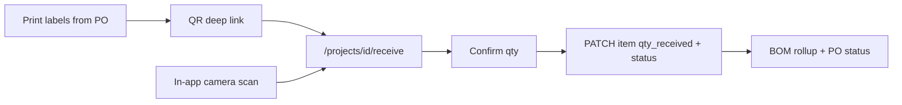

# QR Receiving (labels + scan page)

## Locked decisions (from you)

- **Generate + scan:** printable QR labels for PO items, and a scan-to-receive UI
- **Where:** dedicated project page **and** entry points from Procurement + Tracking
- **Scan default:** one successful scan **receives remaining** (`qty_received = qty_ordered`, status `received` / `partially_received` as appropriate). Confirm sheet shows item details before commit; optional qty override on that sheet for partial receives

## QR payload

Encode a deep link the phone can open cold or in-app:

`/projects/{projectId}/receive?item={poItemId}`

No new DB columns. Identity is existing `purchase_order_items.id`.

## Architecture

## 1. Receive API behavior (shared by scan + existing editors)

Update `[src/app/api/projects/[id]/purchase-orders/[poId]/items/[itemId]/route.ts](src/app/api/projects/[id]/purchase-orders/[poId]/items/[itemId]/route.ts)`:

- When `qty_received` changes and `item_status` is not explicitly sent, derive status:
  - `qty_received >= qty_ordered` → `received`
  - `qty_received > 0` → `partially_received`
- After item update, recompute parent PO status via existing `[suggestPoStatus](src/lib/projects/procurement.ts)` and PATCH the PO

Add a small receive helper endpoint for the scan UI (avoids needing `poId` in the client before resolve):

- `POST /api/projects/[id]/receive` body `{ itemId, qty_received? }`
  - Auth: `canReceive` / managers
  - Load item by id, verify its PO belongs to the project
  - Apply remaining-qty default if `qty_received` omitted
  - Same status + rollup + PO status side effects as item PATCH

## 2. Dedicated receive page (mobile-first)

- Route: `[src/app/(app)/projects/[id]/receive/page.tsx](src/app/(app)`/projects/[id]/receive/page.tsx)
- Client UI: `QrReceiveView`
  - Camera scanner (prefer `BarcodeDetector` when available; fallback `html5-qrcode`)
  - Manual paste/fallback for QR URL or item id
  - On scan / `?item=` query: fetch item summary, show confirm card (PO #, description, SKU, ordered/received)
  - Confirm commits via `POST .../receive`
  - Success / already-complete / error toasts; keep scanner ready for next label
- Gate with `canReceive` (same roles as Tracking receive)

Add nav entry in `[ProjectWorkspaceNav.tsx](src/components/ProjectWorkspaceNav.tsx)`: **Receive** (between Tracking and Labor or next to Tracking).

## 3. Printable QR labels

From Procurement (managers / receivers):

- Per-PO action **Print QR labels** → print-friendly page or window:
  - `/projects/[id]/receive/labels?po={poId}`
  - One label per PO item: QR + PO number, description, SKU, qty ordered
  - Generate QR client-side with `qrcode` (add dependency)

Also a **Print labels** control on the PO header in `[ProcurementView.tsx](src/components/ProcurementView.tsx)`.

## 4. Entry points

- Procurement toolbar / PO header: **QR Receive** → `/projects/[id]/receive`, **Print QR labels** per PO
- Tracking toolbar in `[TrackingView.tsx](src/components/TrackingView.tsx)`: **Scan to receive** → same receive page
- Workspace nav: **Receive**

## 5. Dependencies

- `qrcode` (+ `@types/qrcode`) for label generation
- `html5-qrcode` as camera fallback when `BarcodeDetector` is missing

## Out of scope

- External barcode symbologies (UPC/EAN vendor packs) beyond our Mixinary QR URL
- Offline queue / background sync
- Splitting freight or cost on receive

